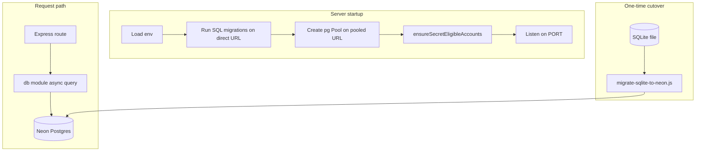

# Neon Database Migration - Plan

## Goal Capsule

**Objective:** Replace local SQLite (`better-sqlite3` in `server.js`) with Neon Postgres so player progress, auth, and leaderboard data persist in a hosted database while keeping the existing Express API and client behavior unchanged.

**Authority hierarchy:** This plan's Product Contract and Key Technical Decisions override ad-hoc implementation choices. Repo conventions apply where the plan is silent.

**Stop conditions:** Stop and surface a blocker if Neon project credentials are unavailable, if SQLite export contains case-duplicate usernames that violate Postgres uniqueness, or if preserving user IDs during migration is impossible without client breakage.

**Execution profile:** Standard refactor with async conversion rippling through all DB-touching routes. Add transactional boundaries where multi-step mutations today lack atomicity.

**Tail ownership:** Implementer removes `better-sqlite3`, updates docs, and verifies cutover before declaring done.

---

## Product Contract

### Summary

Migrate Beat Parry's backend persistence from file-based SQLite to Neon Postgres using `pg` Pool, versioned SQL migrations, and a one-time data import path — without changing REST API shapes or frontend code.

### Problem Frame

The game server stores RUD balances, auth sessions, inventory, skins, scores, and secret unlocks in `data/beat-parry.db` via synchronous `better-sqlite3`. That works for single-machine local play but blocks shared hosting, preview environments, and durable production deployment. Neon provides managed Postgres with branching for dev/preview and a connection string the Express process can use at runtime.

### Requirements

**Persistence & connectivity**

- R1. Runtime reads `DATABASE_URL` (Neon pooled connection string) and fails fast at startup with a clear error when it is missing or invalid.
- R2. Schema migrations run against a direct (non-pooler) connection (`DATABASE_URL_DIRECT` or unpooled URL) before the server accepts traffic.
- R3. All six current tables exist on Postgres with equivalent constraints: `users`, `user_sessions`, `best_scores`, `user_inventory`, `user_redeemed_codes`, `user_owned_skins`.
- R4. Username uniqueness is case-insensitive (equivalent to SQLite `COLLATE NOCASE`).
- R5. Timestamp columns use `TIMESTAMPTZ` with `NOW()` defaults; session expiry comparisons behave the same as today.

**Behavior preservation**

- R6. Every existing `/api/*` route returns the same status codes and JSON shapes for equivalent inputs.
- R7. User IDs from SQLite are preserved during migration so client `localStorage` user IDs and session tokens remain valid.
- R8. Secret-eligible account bootstrap (`kevin`, `keios`) still runs at server start.
- R9. Profile read side-effects (`ensureOverdriveBonus`, `ensureVoidGodSkin`, expired session deletion) continue to work.

**Atomicity improvements (within migration scope)**

- R10. Shop buy, skin buy, consume, redeem, and complete flows use database transactions so a mid-request failure cannot leave debit-without-grant or partial unlock state.
- R11. Concurrent register on the same legacy username resolves to one winner (unique violation or row lock), not duplicate password writes.

**Developer experience**

- R12. `.env.example` documents required env vars; README explains Neon setup and dev branching.
- R13. Health endpoint confirms database connectivity (`SELECT 1`), not just process liveness.
- R14. Automated tests cover auth, buy, consume, and migration-critical paths using a test database URL.

### Scope Boundaries

**In scope:** `server.js` DB layer extraction, Postgres schema/migrations, `pg` integration, env wiring, one-time SQLite import tooling, README updates, initial API integration tests.

**Out of scope:** Frontend changes, new game features, ORM adoption, read replicas, multi-region Neon config, production hosting/CI beyond documenting env vars.

#### Deferred to Follow-Up Work

- Idempotency keys on `POST /api/users/:id/complete` to prevent double RUD on client retries.
- Session revocation on login ("logout everywhere").
- Removing hardcoded secret-account passwords from source (security hardening).
- Full route modularization into separate router files (optional cleanup beyond minimal DB extraction).

### Success Criteria

- Server starts against Neon with empty DB, register/login/profile/shop/complete/leaderboard work end-to-end.
- After importing an existing `data/beat-parry.db`, migrated users log in and retain balances, inventory, scores, and skins.
- `npm test` passes against a configured `TEST_DATABASE_URL`.
- `better-sqlite3` is removed from `package.json`.

---

## Planning Contract

### Assumptions

Confirmed at scoping (sensible defaults):

- Existing SQLite file is migrated when present; greenfield setups start with empty Neon schema only.
- A small `db/` module is extracted rather than keeping all SQL inline in `server.js`.
- Local dev uses Neon branches / remote connection strings only (no local Postgres or SQLite fallback).
- Query layer is `pg` Pool with parameterized SQL (no ORM).

### Key Technical Decisions

**KTD-1: `pg` Pool with Neon pooled URL**

Use `pg` (node-postgres) with a small module-level pool (`max` 5–10) and the Neon `-pooler` hostname for the long-running Express server. Reserve `@neondatabase/serverless` for edge/serverless runtimes; Express on a persistent Node process benefits from direct TCP and full interactive transactions.

**KTD-2: `citext` for case-insensitive usernames**

Enable `CREATE EXTENSION IF NOT EXISTS citext` and define `users.username` as `CITEXT NOT NULL UNIQUE`. Queries use plain equality (`WHERE username = $1`) without `COLLATE` clauses. This is the closest Postgres analogue to SQLite `COLLATE NOCASE`.

**KTD-3: Versioned SQL migrations via `postgres-migrations`**

Replace boot-time SQLite introspection (`PRAGMA`, `sqlite_master`) with numbered files in `migrations/` tracked by `postgres-migrations`. Run migrations once at startup using the direct connection string before creating the runtime pool.

**KTD-4: Async route handlers throughout**

Convert all DB-touching Express handlers to `async` functions using `await pool.query(...)`. `INSERT ... RETURNING id` replaces `lastInsertRowid`. Placeholders change from `?` to `$1, $2, ...`.

**KTD-5: Transactions on multi-step mutations**

Wrap buy, buy-skin, consume, redeem, complete, and legacy register-claim paths in `BEGIN` / `COMMIT` / `ROLLBACK` using a dedicated client from `pool.connect()`. Balance debits use `UPDATE ... WHERE rud_balance >= $price RETURNING rud_balance` to prevent negative balances under concurrency.

**KTD-6: One-time SQLite import script**

Provide `scripts/migrate-sqlite-to-neon.js` that reads `data/beat-parry.db` with `better-sqlite3` (devDependency only), inserts rows in FK order, and resets sequences. Document pgloader as an alternative in README. Pre-flight check: fail if `LOWER(username)` has duplicates.

### Output Structure

```text
db/
  pool.js
  migrate.js
  users.js
  sessions.js
  scores.js
  inventory.js
  skins.js
  codes.js
migrations/
  001_initial.sql
scripts/
  migrate-sqlite-to-neon.js   # one-time import; keeps better-sqlite3 as devDep
test/
  api.test.js
.env.example
server.js                     # slimmed Express app
```

### High-Level Technical Design



**Module boundaries**

| Module | Responsibility |
|--------|----------------|
| `db/pool.js` | Pool creation, `query()`, `withTransaction(fn)` helper |
| `db/migrate.js` | Run `postgres-migrations` against direct URL |
| `db/users.js` | User CRUD, balance updates, equipped skin |
| `db/sessions.js` | Session create/lookup/delete |
| `db/scores.js` | Best score reads/upserts |
| `db/inventory.js` | Inventory get/add/consume |
| `db/skins.js` | Owned skins |
| `db/codes.js` | Redeemed secret codes |
| `server.js` | Express app, routes (slimmed), catalog constants |

### System-Wide Impact

- **Environment:** `DATABASE_URL` and `DATABASE_URL_DIRECT` become required for server startup; document in `.env.example`.
- **Client:** `js/currency.js` stores `beatParryUserId` — ID preservation during migration is mandatory (R7).
- **Operations:** Neon scale-to-zero may add cold-start latency; pool `connectionTimeoutMillis` and health check mitigate this.
- **Secrets:** Hardcoded secret-account passwords remain in source (unchanged behavior); note in deferred work.

### Risks & Dependencies

| Risk | Mitigation |
|------|------------|
| Async refactor misses `await` | Lint/review; integration tests on all routes |
| Migration via pooled URL breaks DDL | Migrations always use direct URL (KTD-3) |
| Case-duplicate usernames in SQLite | Pre-import validation script; manual merge |
| Sequence drift after import | `setval` on `users.id` after data load |
| pgloader connection quirks | Prefer Node import script; document Neon pgloader URL format in README |
| No existing test harness | U6 introduces `node:test` + `supertest` baseline |

### Cutover sequence

1. Create Neon project and dev branch; copy pooled and direct connection strings into `.env`.
2. Deploy schema: start server (U2 migrations) against empty branch, or run migrations manually.
3. Import data: `node scripts/migrate-sqlite-to-neon.js` against dev branch; verify row counts and spot-check logins.
4. Deploy Neon-backed code (U4+); smoke-test register, buy, complete, leaderboard.
5. Repeat import on production branch during production cutover.

**Rollback:** Redeploy prior SQLite-backed build and restore `data/beat-parry.db` from backup; or reset Neon branch from parent and re-import.

### Open Questions

- **Deferred:** Target Neon project/branch naming convention for this repo (implementer creates per team preference).

### Sources & Research

- Neon connection guidance: [Choosing your connection method](https://neon.com/docs/connect/choose-connection), [Connection pooling](https://neon.com/docs/connect/connection-pooling)
- SQLite import: [Migrate from SQLite](https://neon.com/docs/import/migrate-sqlite)
- Branching: [Database branching workflow](https://neon.com/docs/get-started/workflow-primer)
- Postgres `citext`: [PostgreSQL citext docs](https://www.postgresql.org/docs/current/citext.html)
- Current implementation: `server.js` (monolithic SQLite), `js/currency.js` (client user ID persistence)

---

## Implementation Units

### U1. Dependencies and environment wiring

**Goal:** Add Postgres client stack and document required Neon env vars.

**Requirements:** R1, R12

**Dependencies:** None

**Files:**
- `package.json`
- `.env.example` (create)
- `README.md` (Neon setup section only)

**Approach:** Add `pg` and `postgres-migrations` dependencies. Add `better-sqlite3` as optional `devDependency` for the one-time import script only. Create `.env.example` with `DATABASE_URL`, `DATABASE_URL_DIRECT`, and `PORT`. Update README with Neon project creation, branching for dev, and connection string copy steps.

**Patterns to follow:** Existing `PORT = process.env.PORT || 3000` pattern in `server.js`.

**Test scenarios:**
- Test expectation: none — packaging and documentation only.

**Verification:** `npm install` succeeds; `.env.example` lists all required vars; README documents Neon setup.

---

### U2. Postgres schema and migration runner

**Goal:** Define the full Postgres schema as versioned SQL and run migrations at startup.

**Requirements:** R2, R3, R4, R5

**Dependencies:** U1

**Files:**
- `migrations/001_initial.sql` (create)
- `db/migrate.js` (create)
- `db/pool.js` (create — pool only; query helpers in U3)

**Approach:** `001_initial.sql` creates `citext` extension and all six tables with `BIGINT GENERATED BY DEFAULT AS IDENTITY` PKs, `TIMESTAMPTZ` defaults, and unique/PK constraints matching current SQLite semantics. Map `INSERT OR IGNORE` targets to `ON CONFLICT DO NOTHING` via existing unique constraints. `db/migrate.js` runs `postgres-migrations` against `DATABASE_URL_DIRECT` (fallback: strip `-pooler` from pooled URL). `db/pool.js` exports `getPool()` configured from `DATABASE_URL` with `max: 10`, TLS via Neon connection string defaults (`sslmode=require` in URL) plus `ssl: { rejectUnauthorized: true }` when not embedded in the string, and pool error logging.

**Technical design (directional):**

```sql
-- users: username citext UNIQUE, password_hash TEXT, rud_balance, equipped_skin default 'default', created_at TIMESTAMPTZ
-- user_sessions: token PK, expires_at TIMESTAMPTZ
-- best_scores: PK (user_id, song_id)
-- Composite PKs on inventory, redeemed_codes, owned_skins
```

**Patterns to follow:** Replace inline `migrateRedeemedCodesTable`, `migrateUsersAuth`, `migrateSkins` logic — final schema is authoritative; no runtime introspection migrations.

**Test scenarios:**
- Fresh DB: migrations apply cleanly; `\dt` equivalent shows six tables.
- Re-run startup: migrations are idempotent (no error on second run).
- `citext`: inserting `Alice` then registering `alice` fails unique constraint.

**Verification:** Start server against empty Neon branch; logs confirm migration success; `information_schema.tables` lists all tables.

---

### U3. DB query module (async data access)

**Goal:** Extract synchronous `db.prepare` helpers into async `db/*` modules using `pg`.

**Requirements:** R3, R4, R5, R6

**Dependencies:** U2

**Files:**
- `db/users.js`
- `db/sessions.js`
- `db/scores.js`
- `db/inventory.js`
- `db/skins.js`
- `db/codes.js`
- `db/pool.js` (add `query`, `withTransaction`)

**Approach:** Port each helper from `server.js` to parameterized async functions. Session lookup JOINs `user_sessions` and `users`. Expired session delete on read preserved. `createSession` uses `INSERT ... RETURNING`. Inventory upsert uses `ON CONFLICT DO UPDATE`. Secret unlock inserts use `ON CONFLICT DO NOTHING`. Extract `upsertBestScore` from `calculateReward` into `db/scores.js` so best-score writes are explicit and transaction-scoped. Export a `withTransaction(client => ...)` helper for U4.

**Patterns to follow:** Mirror existing function names and return shapes from `server.js` helpers (`getUser`, `getBestScores`, `buildUserProfile` inputs, etc.).

**Test scenarios:**
- `getUser` returns row for valid id; undefined/null for missing id.
- `getSessionUser` with expired `expires_at` deletes row and returns null.
- Case-insensitive username lookup: `kevin` matches stored `Kevin`.
- `addInventory` upsert increments quantity on conflict.

**Verification:** Unit-test db modules against test DB URL (U6) or manual SQL verification.

---

### U4. Async Express refactor and transactions

**Goal:** Wire routes to async db modules, add transactional boundaries, and improve health check.

**Requirements:** R6, R8, R9, R10, R11, R13

**Dependencies:** U3

**Files:**
- `server.js` (modify — remove `better-sqlite3`, use db modules)

**Approach:** Convert all DB-touching route handlers to `async`. Replace direct `db.prepare` calls with db module imports. Wrap these paths in `withTransaction`: register (legacy claim), buy, buy-skin, consume, redeem, complete. The `complete` handler calls `upsertBestScore` (when applicable) and balance credit inside one transaction. Register uses `SELECT ... FOR UPDATE` on user row during legacy claim. `GET /api/health` runs `SELECT 1`. Keep `ensureSecretEligibleAccounts` at listen using `INSERT ... ON CONFLICT (username) DO UPDATE`. Remove SQLite file creation, WAL pragma, and inline migration functions.

**Execution note:** Implement transactional buy/consume tests (U6) alongside route changes to prove atomicity.

**Patterns to follow:** Existing route paths, status codes, and JSON response shapes in `server.js`.

**Test scenarios:**
- Covers auth register/login/me/logout happy paths.
- Legacy user with null `password_hash`: register with same username claims account, preserves `id` and balance.
- Concurrent register on same new username: one 200, one 400.
- Buy with insufficient balance: 400, balance unchanged.
- Buy with exact balance: 200, inventory granted, balance zero.
- Parallel buy draining balance 120: exactly one of two 120-cost purchases succeeds.
- Consume last inventory item: quantity reaches 0; second consume returns 400.
- Complete with new best score: `bestScores` and balance both update in response.
- `GET /api/health` returns `{ok:true}` only when DB reachable; returns 503 when DB down.
- Secret-eligible user `/api/auth/me` auto-grants void-dash and void-god skin when overdrive present.

**Verification:** Manual smoke through browser at `localhost:3000` plus automated tests from U6 pass.

---

### U5. SQLite-to-Neon data migration script

**Goal:** One-time tooling to import existing local SQLite data into Neon with ID preservation.

**Requirements:** R7

**Dependencies:** U2

**Files:**
- `scripts/migrate-sqlite-to-neon.js` (create)
- `README.md` (migration section)

**Approach:** Script accepts `--sqlite-path` (default `data/beat-parry.db`) and uses `DATABASE_URL_DIRECT`. Pre-flight: abort if file missing (exit 0 with message for greenfield); abort if case-duplicate usernames. Insert order: users → sessions → best_scores → inventory → redeemed_codes → owned_skins. Use explicit `id` column inserts. After import, `SELECT setval(pg_get_serial_sequence('users','id'), MAX(id)+1, false)`. Log row counts per table. Document pgloader alternative for large datasets.

**Patterns to follow:** Table/column names from `migrations/001_initial.sql`.

**Test scenarios:**
- Empty/missing SQLite file: script exits gracefully with instructions.
- Sample SQLite with two users, scores, inventory: after import, row counts match; `id` values match; login works.
- Case-duplicate usernames in SQLite: script fails with clear error before any insert.

**Verification:** Import a copy of dev SQLite into a Neon dev branch; spot-check 3 users via API login and profile.

---

### U6. API integration test harness

**Goal:** Add automated tests for critical API flows against a test Neon database (or disposable branch).

**Requirements:** R14

**Dependencies:** U4

**Files:**
- `test/api.test.js` (create)
- `package.json` (add `test` script, devDependencies: `supertest`)

**Approach:** Use Node built-in `node:test` and `supertest`. Tests require `TEST_DATABASE_URL` (or `DATABASE_URL` in test env). `before` hook runs migrations; `afterEach` truncates tables (or uses per-test transaction rollback). Cover auth, buy, consume, complete, and health flows (listed in Test scenarios above).

**Execution note:** Start with a failing integration test for register+login before refactoring routes (optional TDD).

**Patterns to follow:** Express app export pattern — refactor `server.js` to export `app` for supertest while keeping `listen` in main block.

**Test scenarios:**
- Register new user → login → GET `/api/auth/me` returns profile with token.
- Buy ability → inventory count increases, balance decreases.
- Consume ability → inventory decrements.
- Complete run with score → balance increases.
- Health returns 200 when DB up.

**Verification:** `npm test` exits 0 with `TEST_DATABASE_URL` set.

---

### U7. Remove SQLite runtime dependency and finalize docs

**Goal:** Remove production SQLite dependency and document the new persistence model.

**Requirements:** R12, success criteria

**Dependencies:** U4, U5, U6

**Files:**
- `package.json` (remove runtime `better-sqlite3`)
- `README.md`
- `.gitignore` (optional note that `data/` is legacy local only)

**Approach:** Remove `better-sqlite3` from production dependencies (keep in devDependencies for migration script if needed). Update README: replace SQLite references with Neon; document env vars, dev branch workflow, migration script, and test setup. Update `package.json` description.

**Test scenarios:**
- Test expectation: none — docs and dependency cleanup.

**Verification:** `npm ls better-sqlite3` shows only devDependency or none; README accurately describes Neon persistence; full manual playthrough works.

---

## Verification Contract

| Gate | Command / action | When |
|------|------------------|------|
| Install | `npm install` | After U1 |
| Migrations | Start server against empty Neon branch | After U2 |
| Unit/integration tests | `TEST_DATABASE_URL='...' npm test` | After U6 |
| Migration fidelity | `node scripts/migrate-sqlite-to-neon.js` against dev branch with sample DB | After U5 |
| Smoke | `npm start` → register, play, buy, complete, leaderboard in browser | After U7 |
| Dependency check | `npm ls pg` present; no runtime `better-sqlite3` | After U7 |

No CI workflow exists today; adding `.github/workflows/test.yml` is deferred unless the implementer chooses to include it.

---

## Definition of Done

**Global**

- Server runs on Neon only; `DATABASE_URL` required.
- All R1–R14 requirements satisfied.
- `npm test` passes with test database configured.
- SQLite import script documented and verified on sample data.
- No runtime `better-sqlite3` dependency.
- Abandoned experimental code from migration attempts removed.

**Per unit**

| Unit | Done when |
|------|-----------|
| U1 | `pg`, `postgres-migrations` installed; `.env.example` complete |
| U2 | Migrations apply on fresh Neon; schema matches six tables |
| U3 | All db helpers async; no `db.prepare` in server |
| U4 | All routes async; transactions on multi-step ops; health checks DB |
| U5 | Import script preserves IDs and row counts |
| U6 | `npm test` green |
| U7 | README and package.json reflect Neon; SQLite removed from runtime deps |
